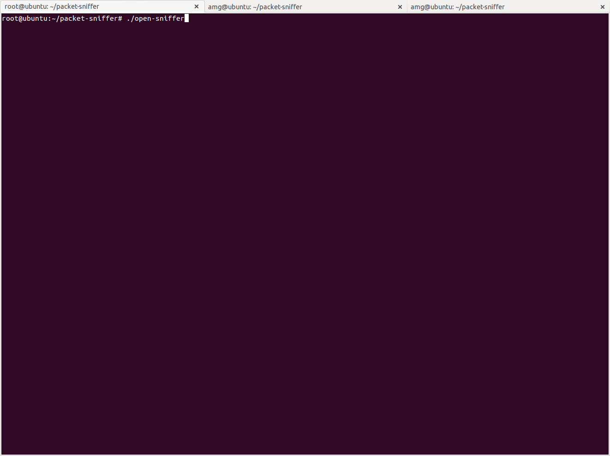

 

# Open sniffer

A POSIX utility used to sniff and dissect network packets.

Current version: **1.0.0**

Lead Maintainer: [Halim Qarroum](mailto:hqm.post@gmail.com)

## Description

This project was primarily written for learning purposes. It is at the disposal of anyone wanting to know more about how an [OSI stack](https://en.wikipedia.org/wiki/OSI_model) implementation actually works, and what network packets are made of.

Basically, this sniffer relies on raw sockets (so it requires root priviledges or [CAP_NET_RAW](https://stackoverflow.com/questions/7860690/using-setcap-in-linux) capability) and intercepts the packets transiting over the network interface. It will then forward the packet to an instance of an OSI stack which will pass the packet to the appropriate dissectors available for each layer of the stack.

## Supported protocols

 - [ARP](https://en.wikipedia.org/wiki/Address_Resolution_Protocol)
 - [DHCP](https://en.wikipedia.org/wiki/Dynamic_Host_Configuration_Protocol)
 - [DNS](https://en.wikipedia.org/wiki/Domain_Name_System)
 - [Ethernet](https://en.wikipedia.org/wiki/Ethernet)
 - [HTTP](https://en.wikipedia.org/wiki/Hypertext_Transfer_Protocol)
 - [ICMP](https://en.wikipedia.org/wiki/Internet_Control_Message_Protocol)
 - [IP](https://en.wikipedia.org/wiki/Internet_Protocol)
 - [TCP](https://en.wikipedia.org/wiki/Transmission_Control_Protocol)
 - [UDP](https://en.wikipedia.org/wiki/User_Datagram_Protocol)

## Usage

### Capturing all the traffic

The only behaviour implemented by the application for now is to display every packets captured on the network interface in the form of a graphically stacked representations of each OSI layers. To launch the application, simply execute it without argument.

To illustrate the result I recorded a sniffing session while retrieving the index page of `example.com` in a small screencast. Note that the rate at which the packets are displayed was voluntarily slowed down for the sake of the demonstration.

## Plugins

A simple plugin management system is available in this project which aims to be a way to add a functionality to the sniffer without mofifying any of its core code. An example of a plugin would be a presenter which will for instance show the sniffed packet into a remote web user interface, instead of the stadard output in the console.

## Building

For now, a simple Makefile is available for building the project, so you simply need to run `make`. Note that you are required to also pull the sole dependency of this project, an implementation of a circular linked list which is packaged as a submodule. The project was built and tested on a Linux 3.13 (64 bits). 

An integration with `CMake` is planned.

## Todos

 - Implementing a complete command-line interface for filtering purposes.
 - Managing reconstruction of packets when using stateful protocols such as TCP.
 - Adding support for Gzip in order to decompress HTTP contents.
 - Adding the ability to export capture to PCAP.
 - Adding the ability to activate promiscuous mode.
 - Adding functional tests.
 - CI integration with Travis.
